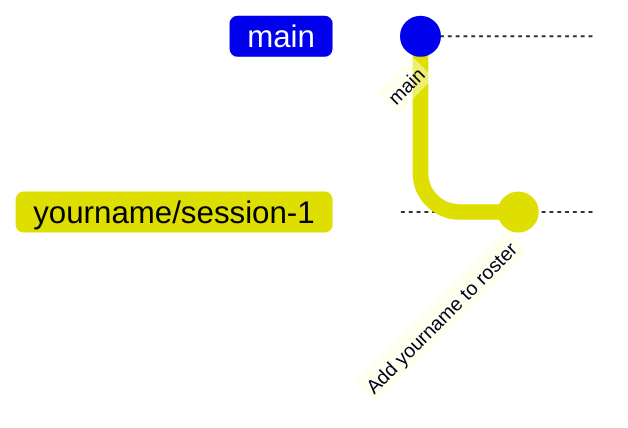

# Your First Commit

Time to put your name on the team's code. You will create a branch, add a file, commit it, and push it to GitHub. This is the same workflow you will use for every change you make all season.

## 🧠 The idea in one picture



- **main** is the team's official code. You never edit it directly. It is protected.
- A **branch** is your own copy to work on. You name it after yourself and the work.
- A **commit** is a saved snapshot with a message explaining what changed.
- **Push** sends your branch and its commits to GitHub so the team can see them.

## 1. Create a branch

1. Look at the bottom-left of the status bar. It says `main`. Click it.
2. Choose **Create new branch...**
3. Type your branch name and press ++enter++. Use this pattern, with your own GitHub username:

    ```text
    yourname/session-1
    ```

You will see: the status bar now shows your branch name instead of `main`.

!!! tip "Branch naming"

    All season, name branches `yourname/what-it-does`. Examples: `yourname/session-2`, `yourname/fix-arm-limits`. The team can tell at a glance whose work it is and what it is for.

## 2. Add yourself to the roster

The `team/` folder holds one file per programmer.

1. In the Explorer, right-click the `team` folder and choose **New File...**
2. Name it with your GitHub username: `yourname.md`
3. Type this into the file, filling in your own details:

    ```markdown title="team/yourname.md"
    # Your Name

    - GitHub: @yourname
    - Grade: 9
    - Why I joined programming: ...
    - One thing I want to build this season: ...
    ```

4. Save with ++ctrl+s++.

You will see: the file name turns green in the Explorer and a badge with the number 1 appears on the Source Control icon. Git noticed your new file.

## 3. Commit

1. Open **Source Control** from the left bar.
2. Your file is listed under **Changes**. Hover over it and click the **+** to stage it. It moves to **Staged Changes**.
3. In the message box at the top, type a message that says what the change does:

    ```text
    Add yourname to the team roster
    ```

4. Click **Commit**.

You will see: the Changes list is empty and the Commit button changes to **Publish Branch**.

!!! note "Good commit messages"

    Say what the change does, in the present tense, in one short line. "Add arm subsystem", "Fix inverted drive motor", "Slow down autonomous turn". Future you, and your teammates, will read these.

## 4. Push

Click **Publish Branch**.

You will see: after a moment, a notification that the branch was published. Your work is now on GitHub.

## 5. See it on GitHub

1. Open the [`2026-bootcamp` repository](https://github.com/gryphoncommand/2026-bootcamp) in a new tab.
2. Click the branch dropdown that says **main** near the top-left and pick your branch.
3. Open the `team` folder. Your file is there.
4. Click the commit count or **History** to see your commit with your name and picture next to it.

You will see: your commit, your file, your name. That is your first contribution to the team's repository.

## 🎉 Bonus: see it from the terminal

Everything you just clicked is also a command. In the terminal, run:

```bash
git log --oneline -3
```

You will see: your commit at the top, and the commits that were already on `main` below it. Session 2 uses a few more of these commands.

## 🛑 Before you leave

- [ ] Your branch shows on GitHub with your commit.
- [ ] Stop your Codespace (bottom-left Codespaces button, **Stop Current Codespace**).

## ✅ Done when

- [ ] Your branch exists on GitHub.
- [ ] It has a commit with your name on it.
- [ ] `team/yourname.md` exists on that branch.
