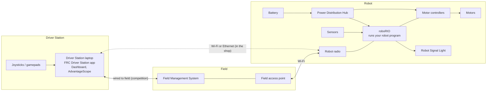
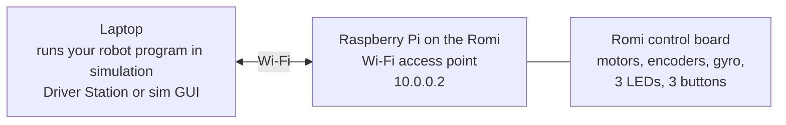

# The FRC Stack

An FRC robot is not one thing. It is a system of computers, radios, controllers, and programs that all have to agree with each other. This page is a guided tour. You do not need to memorize it. By the end you should be able to trace what happens between a driver moving a joystick and a wheel turning.

## 🧱 The big picture

Read it left to right. The driver's inputs go into the Driver Station laptop, across a network, to the roboRIO on the robot. Your program runs on the roboRIO. It reads sensors and joysticks, decides what to do, and tells motor controllers how much power to send to motors.

## 🔩 Hardware

| Component | What it does | Talks to |
| --------- | ------------ | -------- |
| **Driver Station laptop** | Runs the Driver Station app, a dashboard, and your programming tools | Joysticks by USB, robot by network |
| **Robot radio** | Wi-Fi bridge between the robot and the field or your laptop | roboRIO by Ethernet |
| **roboRIO** | The robot's computer. Runs your Java program | Radio, motor controllers, sensors |
| **Power Distribution Hub (PDH)** | Splits battery power to everything with breakers and fuses | Battery, roboRIO, motor controllers |
| **Motor controllers** (SPARK MAX, Kraken, and others) | Turn a command like "60% forward" into power for a motor | roboRIO over a CAN bus |
| **Motors** | Make things move | Motor controllers |
| **Sensors** (encoders, gyro, limit switches, cameras) | Tell the program what the robot is doing | roboRIO, or through a motor controller |
| **Robot Signal Light (RSL)** | Orange light that shows the robot's state: solid when disabled, blinking when enabled | roboRIO |
| **Battery** | 12 volt lead-acid battery. Everything runs off it | PDH through the main breaker |

!!! note "Remember the RSL"

    Solid means disabled. Blinking means enabled and could move. In Session 2 you program the Romi's yellow LED to behave the same way.

## 💻 Software

| Program | Runs on | What you use it for |
| ------- | ------- | ------------------- |
| **VS Code with the WPILib extension** | Your laptop, or a Codespace in the browser | Writing, building, testing, and deploying robot code |
| **WPILib** | Inside your robot program | The library every FRC Java program is built on |
| **FRC Driver Station** | Driver Station laptop (Windows only) | Connecting to the robot, choosing a mode, enabling and disabling |
| **Dashboard** (SmartDashboard, Shuffleboard, or Elastic) | Driver Station laptop | Seeing values from the robot and sending it choices, such as which autonomous to run |
| **AdvantageScope** | Any laptop | Plotting and replaying data the robot logs. Your best debugging tool |
| **REV Hardware Client** | Any laptop, by USB to the device | Updating firmware and configuring SPARK MAX motor controllers |
| **Your robot program** | roboRIO | Everything the robot does |

## 🔁 The robot program lifecycle

Your program starts once when the roboRIO boots, then runs in a loop about 50 times per second. Which part of your code runs depends on the robot's **mode**. The Driver Station (or the field at competition) picks the mode.

| Mode | When | What your code does |
| ---- | ---- | ------------------- |
| **Disabled** | Whenever the robot is not enabled. Also the state at startup | Nothing moves. Read sensors, update the dashboard |
| **Autonomous** | First 20 seconds of a match | Runs without driver input |
| **Teleoperated** | Rest of the match | Follows the driver's joysticks |
| **Test** | Only from the Driver Station, in the shop | Whatever you set up for checking hardware |

Session 2 opens up the program and shows you exactly where each of these lives.

## 🌐 Networks

Every device on the robot network has an IP address built from your **team number**. Write the team number as four digits, split it in the middle, and drop leading zeros from each half.

| Team number | Address pattern | Example roboRIO address |
| ----------- | --------------- | ----------------------- |
| 254 | `10.2.54.x` | `10.2.54.2` |
| 1234 | `10.12.34.x` | `10.12.34.2` |
| 9999 | `10.99.99.x` | `10.99.99.2` |

The pattern is written `10.TE.AM.x`. Fill in your own team number wherever you see `TE.AM`.

| Device | Address |
| ------ | ------- |
| Robot radio | `10.TE.AM.1` |
| roboRIO | `10.TE.AM.2` |
| Driver Station laptop | `10.TE.AM.5` or assigned automatically |

You rarely type these. WPILib and the Driver Station find the robot by name, `roboRIO-TEAM-FRC.local`, where `TEAM` is your team number. You type the team number once, in the WPILib project settings and once in the Driver Station, and the tools do the rest.

There are three ways your laptop reaches the robot:

- **USB cable** to the roboRIO. Simplest. Always works in the shop.
- **Ethernet cable** to the radio. Reliable. Used at competition between the laptop and the field.
- **Wi-Fi** to the robot radio. Convenient in the shop. Never used from your laptop at competition, because the field's access point owns the robot's radio there.

## 🤖 Where the Romi fits

During the bootcamp, the target robot is a **Romi**. It is a small two-wheel robot with a Raspberry Pi and a control board. It maps onto the full stack like this:

| Full robot | Romi |
| ---------- | ---- |
| roboRIO runs your program | **Your laptop** runs your program in simulation mode |
| Robot radio at `10.TE.AM.1` | Raspberry Pi is the Wi-Fi access point, robot at `10.0.0.2` |
| Motor controllers and CAN bus | Built into the control board |
| RSL | Yellow LED on the control board (you will program it) |
| Sensors | Two wheel encoders and a gyro on the control board |

The code you write for the Romi uses the same WPILib classes and the same program structure as the competition robot. That is why it is such a good practice target.

!!! info "Why Codespaces cannot drive the Romi"

    A Codespace is a computer in the cloud. The Romi is on a Wi-Fi network in the room. They cannot see each other. That is why the bootcamp uses Codespaces for writing and testing code, and the programming laptops for simulating and running it on the Romi.

## 🏁 Check yourself

Trace this with a partner, out loud: the driver pushes a joystick forward. Name every device the signal passes through before a wheel turns. Then do it backwards for an encoder reading showing up on the dashboard.
