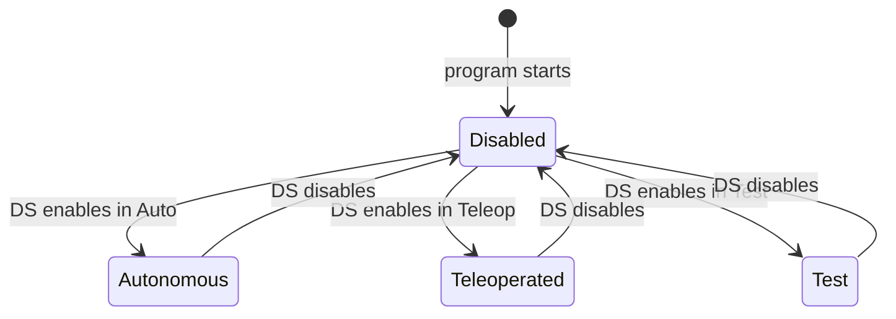
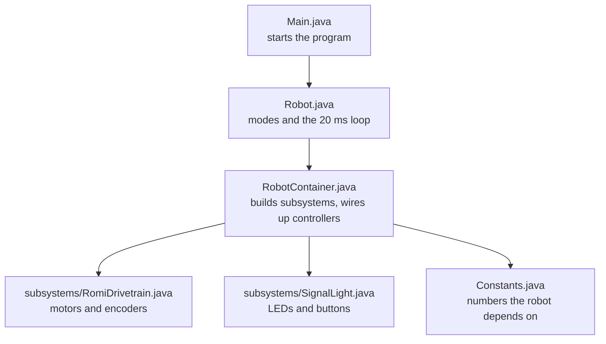

# Anatomy of Robot Code

Open `src/main/java/frc/robot/Robot.java` in your Codespace and keep it next to this page. Every FRC robot program has this shape. Once you can read this file, you can read any robot's code.

## 🔁 The robot's life

A robot program does not run top to bottom like a script. It starts once, then runs in a loop, 50 times per second, until the robot is turned off. Which code runs in each loop depends on the robot's **mode**.



| Mode | When | What the robot does |
| ---- | ---- | ------------------- |
| **Disabled** | At startup, and whenever the Driver Station says so | Nothing moves. Motors are off no matter what the code says |
| **Autonomous** | First 20 seconds of a match | Runs on its own. No driver input |
| **Teleoperated** | Rest of the match | Follows the driver's controller |
| **Test** | Only from the Driver Station in the shop | Whatever you set up to check hardware |

The Driver Station (or the field at competition) picks the mode. Your code never picks it. Your code only reacts.

## 🧩 One file, top to bottom

`Robot.java` is short. Here is what each part is for.

### The header

```java title="src/main/java/frc/robot/Robot.java"
package frc.robot;

import edu.wpi.first.wpilibj.TimedRobot;
import edu.wpi.first.wpilibj2.command.Command;
import edu.wpi.first.wpilibj2.command.CommandScheduler;
```

- `package` says which folder this file lives in. `frc.robot` is the folder `src/main/java/frc/robot`.
- Each `import` brings in one class from WPILib so you can use it by its short name.

### The class

```java
public class Robot extends TimedRobot {
```

This file defines one **class** named `Robot`. `extends TimedRobot` means WPILib's `TimedRobot` already knows how to start up and loop 50 times per second. Your class fills in what happens at each step.

### The attributes

```java
  private Command m_autonomousCommand;

  private final RobotContainer m_robotContainer;
```

These are the robot's **attributes**: variables that belong to the robot and live as long as it runs. WPILib code names them with an `m_` prefix so you can tell them apart from short-lived variables inside a method.

### The constructor: runs once

```java
  public Robot() {
    m_robotContainer = new RobotContainer();
  }
```

The **constructor** has the same name as the class and runs exactly once, when the program starts. It builds the `RobotContainer`, which in turn builds every subsystem. This is where one-time setup goes.

### The periodic method: runs every loop

```java
  @Override
  public void robotPeriodic() {
    CommandScheduler.getInstance().run();
  }
```

`robotPeriodic()` runs every 20 milliseconds in **every** mode. The one line inside it runs the command scheduler, which is the engine of a command-based robot. Session 3 opens that up.

`@Override` tells Java "TimedRobot already has a method with this name, and I am replacing it with mine." If you misspell the method name, `@Override` turns that into a compile error instead of a silent bug.

### The mode methods: init and periodic pairs

```java
  @Override
  public void disabledInit() {}

  @Override
  public void disabledPeriodic() {}
```

Every mode has a pair:

- **`xxxInit()`** runs **once**, the moment the robot enters that mode.
- **`xxxPeriodic()`** runs **every 20 ms** while the robot stays in that mode.

| Method | Runs |
| ------ | ---- |
| `Robot()` | Once, at program start |
| `robotPeriodic()` | Every loop, every mode |
| `disabledInit()` / `disabledPeriodic()` | Entering Disabled / every loop while Disabled |
| `autonomousInit()` / `autonomousPeriodic()` | Entering Autonomous / every loop while Autonomous |
| `teleopInit()` / `teleopPeriodic()` | Entering Teleop / every loop while Teleop |
| `testInit()` / `testPeriodic()` | Entering Test / every loop while Test |

Look at `autonomousInit()` in your file. It asks the `RobotContainer` for the autonomous command and hands it to the scheduler. That is the whole handoff. Session 6 builds the command it hands over.

!!! note "Init or periodic?"

    Ask: does this need to happen once, or over and over? Resetting a counter or starting a timer is init. Reading a joystick or checking a sensor is periodic.

## 🗺️ Where the rest of the code lives



- `Main.java`: you never edit it. It starts `Robot`.
- `Robot.java`: today's file. Modes and the loop.
- `RobotContainer.java`: describes the robot. Session 3.
- `subsystems/`: one class per piece of hardware. Session 3.
- `commands/`: one class per behavior. Session 4.
- `Constants.java`: every number in one place, with a name.

## 🏁 Check yourself

Point to the line in `Robot.java` that would run if the driver enabled the robot in Teleop, waited three seconds, then disabled it. How many times did `teleopPeriodic()` run?
