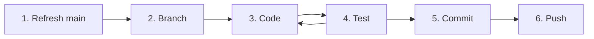

# The Routine

Every session from now on starts and ends the same way. Do it the same way every time, in the same order, until you do not have to think about it. This is how professional teams work, and it is how your code stays safe.



## 0. Start clean

Open your Codespace from [github.com/codespaces](https://github.com/codespaces). Look at the **Source Control** icon in the left bar.

You will see: no number badge on the icon. If there is a badge, you have leftover changes from last time. Commit them on your old branch, or ask a mentor before you discard them.

## 1. Refresh main

Your Codespace remembers whatever branch you used last time. Other people (and your mentors) have pushed new code since then. Start from the newest `main`.

1. Click the branch name in the bottom-left of the status bar.
2. Pick **main** from the list.
3. Click the **sync** icon (circular arrows) that appears next to `main` in the status bar. Or open **Source Control**, click the **...** menu, and choose **Pull**.

You will see: the status bar says `main`, and a notification or the terminal reports the branch is up to date.

!!! tip "The same thing from the terminal"

    ```bash
    git checkout main
    git pull
    ```

    You will see: `Already up to date.` or a list of files that changed.

## 2. Branch

Never edit `main`. Make your own branch for today's work.

1. Click `main` in the status bar.
2. Choose **Create new branch...**
3. Type the name and press ++enter++. Use your GitHub username and the session:

    ```text
    yourname/session-2
    ```

You will see: the status bar now shows your new branch name. VS Code creates the branch from whatever branch you were on, which is why step 1 comes first.

!!! tip "Terminal version"

    ```bash
    git switch -c yourname/session-2
    ```

## 3. Code

Follow the session's exercise page. Save with ++ctrl+s++ as you go. Edited files turn yellow or green in the Explorer.

## 4. Test

Run the tests in the terminal (++ctrl+grave++ opens it):

```bash
./gradlew test
```

You will see: Gradle compiles the code, runs the tests, and ends with `BUILD SUCCESSFUL`. If it says `BUILD FAILED`, scroll up. A compile error names the file and line. A failing test names the test and what it expected.

Test until it passes. Steps 3 and 4 are a loop.

## 5. Commit

1. Open **Source Control**.
2. Hover over **Changes** and click the **+** to stage everything.
3. Type a one-line message that says what the change does, in the present tense.

    ```text
    Log robot mode changes and a once-per-second heartbeat
    ```

4. Click **Commit**.

You will see: the Changes list empties and the button becomes **Publish Branch** (first time) or **Sync Changes**.

!!! note "Small commits"

    Commit every time something works. Two or three commits in a session is normal. A commit is a save point you can always go back to.

## 6. Push

Click **Publish Branch** (or **Sync Changes** if you already published this branch).

You will see: a notification that the branch was published. Check on GitHub: your branch appears in the branch dropdown of the [`2026-bootcamp` repository](https://github.com/gryphoncommand/2026-bootcamp) with your commit on top.

That is the end of the routine. A mentor merges finished work into `main`. Pull requests and code review come after the bootcamp.

## 🛑 Before you leave

- [ ] Your branch is pushed. Anything not pushed lives only in your Codespace.
- [ ] Stop your Codespace: click the Codespaces button in the bottom-left, then **Stop Current Codespace**.

## 🔧 When things go wrong

| You see | What happened | Do this |
| ------- | ------------- | ------- |
| "Please commit your changes or stash them before you switch branches" | You have unsaved work on another branch | Commit it on that branch first, then switch |
| You edited files while still on `main` | You skipped step 2 | Create the branch now. Your edits come with you |
| `./gradlew test` says `BUILD FAILED` with a red test name | Your code does not do what the test expects | Read the line starting with `expected:` and `but was:` |
| `./gradlew test` says `error: cannot find symbol` | A typo in a name, or a missing `import` | Check the spelling on the line it names |
| The Codespace is missing files a session mentions | Your Codespace is older than the latest `main` | Step 1: refresh `main` |
| Gradle sits at `85% EXECUTING` after `simulateJava` | The robot program is running | That is normal. Press ++ctrl+c++ to stop it |
