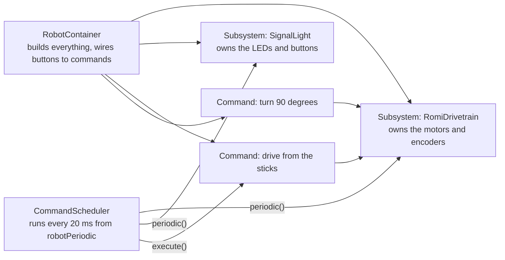

# Command-Based Robots

`Robot.java` runs the loop. But almost none of a real robot's code lives there. It lives in **subsystems** and **commands**, and a **scheduler** decides what runs each loop. This is the command-based structure, and every file you write from now on fits into it.

## 🧠 Three ideas



| Idea | What it is | Rule |
| ---- | ---------- | ---- |
| **Subsystem** | One class per piece of hardware: the drivetrain, an arm, the LEDs. It owns the motors and sensors and offers simple methods like `arcadeDrive()` or `setGreen()` | Only the subsystem touches its hardware |
| **Command** | One class per behavior: drive from the sticks, turn 90 degrees, blink an LED. It uses one or more subsystems | Only one command may use a subsystem at a time. The scheduler enforces it |
| **Scheduler** | The engine. Every 20 ms it runs each subsystem's `periodic()` and each running command's `execute()`, starts commands when buttons are pressed, and stops commands that are finished | You never call it except the one line in `robotPeriodic()` |

`RobotContainer` is the wiring diagram. It creates the subsystems and says which buttons run which commands. Session 4 fills in its `configureButtonBindings()`.

## 💡 The Romi's onboard I/O

The Romi's control board has three LEDs and three buttons, and no motors are involved. That makes it the perfect first subsystem.

| Pin | Can be | This project uses it as |
| --- | ------ | ----------------------- |
| DIO 0 | Button A | Button A |
| DIO 1 | Button B **or** green LED | Green LED |
| DIO 2 | Button C **or** red LED | Button C |
| DIO 3 | Yellow LED | Yellow LED, our robot signal light |

The choice for the shared pins is made once, when the `OnBoardIO` object is created:

```java title="src/main/java/frc/robot/subsystems/SignalLight.java"
private final OnBoardIO m_onboardIO = new OnBoardIO(ChannelMode.OUTPUT, ChannelMode.INPUT);
```

`OUTPUT` for the first shared pin means "green LED". `INPUT` for the second means "button C".

## 🟡 The RSL rule

Every FRC robot has an orange Robot Signal Light so people nearby can tell, at a glance, whether it can move.

| Robot is | Light is |
| -------- | -------- |
| Disabled | Solid on |
| Enabled | Blinking |

The Romi has no RSL, so the yellow LED will play the part. `SignalLight` already runs every loop and asks one question:

```java
m_yellowOn = RslLogic.shouldBeOn(enabled, now);
m_onboardIO.setYellowLed(m_yellowOn);
```

Today you write `shouldBeOn`. Everything else is wired.

!!! info "Why the logic is in its own class"

    `SignalLight` needs hardware. `RslLogic` needs nothing: two values in, one value out. Code with no hardware can be tested in a Codespace in a fraction of a second. Splitting "decide" from "do" is a habit worth building now.
