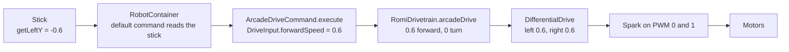

# Controllers to Motors

The driver pushes a stick and a wheel turns. Here is every step in between, in this project's code.

## 🎮 The Xbox controller

WPILib sees a controller as numbered axes and buttons.

| Control | Axis | Value |
| ------- | ---- | ----- |
| Left stick left/right | 0 | -1.0 left to 1.0 right |
| Left stick up/down | 1 | **-1.0 forward** to 1.0 back |
| Right stick left/right | 4 | -1.0 left to 1.0 right |
| Right stick up/down | 5 | -1.0 forward to 1.0 back |
| Triggers | 2, 3 | 0.0 released to 1.0 pulled |

| Button | Number |
| ------ | ------ |
| A, B, X, Y | 1, 2, 3, 4 |
| Left bumper, right bumper | 5, 6 |
| Back, Start | 7, 8 |

!!! warning "Forward is negative"

    Pushing a stick forward gives **-1.0**. That surprises everyone. It comes from old flight-stick conventions, and every FRC team writes code to flip it. So will you.

`CommandXboxController` names these for you, so you never type the numbers:

```java
m_controller.getLeftY()      // axis 1
m_controller.getRightX()     // axis 4
m_controller.a()             // a Trigger for button 1
m_controller.rightBumper()   // a Trigger for button 6
```

## 🔗 The path, end to end



1. **`RobotContainer`** creates the controller and tells the drivetrain: "when nothing else needs you, run `ArcadeDriveCommand`, reading these two sticks."
2. **The scheduler** runs that command's `execute()` every 20 ms.
3. **`execute()`** reads the sticks, cleans the values up with `DriveInput`, and calls `m_drivetrain.arcadeDrive(forward, rotation)`.
4. **`RomiDrivetrain`** hands the two numbers to `DifferentialDrive`, which works out a speed for each side.
5. **`Spark` motor controllers** on PWM channels 0 and 1 turn those speeds into power for the motors.

Every step is a method call you can read. Nothing is hidden.

## ⚡ Motor controllers: the Romi and the real robot

The Romi's motors are driven by simple **PWM** signals: a pulse width says "this much power". The competition robot uses **SPARK MAX** controllers on a **CAN bus**. The idea is the same, the wiring and features differ.

| | Romi (`Spark` on PWM) | Competition robot (`SparkMax` on CAN) |
| --- | --- | --- |
| How it is addressed | PWM channel number (0, 1) | CAN **device ID** (1 to 62), set with the REV Hardware Client |
| Wiring | One signal wire per controller | All controllers share one two-wire bus |
| Feedback to code | None. You add encoders separately | Built in: position, velocity, current, temperature |
| Closed loop | You write it | The controller runs **PID** on board: you send a setpoint, it holds it |
| Code | `new Spark(0)` | `new SparkMax(3, MotorType.kBrushless)` |

Two words you will hear all season:

- **Setpoint**: the value you want, like "1000 RPM" or "45 degrees".
- **PID**: the standard way to get there. The controller measures the error between the setpoint and the sensor, and pushes harder the bigger the error (that is the P). Session 5 shows you the sensor side of that loop.

## 📊 NetworkTables and the dashboard

The robot program keeps a shared table of named values called **NetworkTables**. Anything on the network can read it: the Sim GUI, a dashboard, AdvantageScope. Writing a value is one line:

```java
SmartDashboard.putNumber("Drive/forward", forward);
```

That puts a number named `Drive/forward` in the table, updated every time the line runs. It is how you watch a value change live, without stopping the robot and without filling a log with text.

| Use | Tool |
| --- | ---- |
| "What is this value right now?" | `SmartDashboard.putNumber`, watch it on a dashboard |
| "What happened, and when?" | `DataLogManager.log`, read the log later |
| "Plot this over time" | Publish to NetworkTables, open AdvantageScope. Session 5 |
