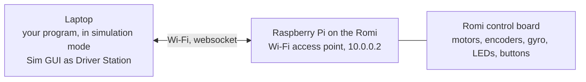

# Run It on the Romi

Everything so far ran on a computer pretending to be a robot. Now the same code drives the real one.

## 🌐 How the Romi is wired



The program does not get copied to the Romi. It runs on the laptop, exactly like the simulator, and every motor command and sensor reading crosses the Wi-Fi link. That is why `build.gradle` has `HALSIMWS_HOST` set to `10.0.0.2`: it is the Romi's address on its own network.

| | Romi | Competition robot |
| --- | ---- | ----------------- |
| Program runs on | Laptop | roboRIO |
| Network | Romi's own Wi-Fi, robot at `10.0.0.2` | Robot radio, roboRIO at `10.TE.AM.2` |
| Driver Station | Sim GUI window | FRC Driver Station app |
| Deploy step | Just run it | `./gradlew deploy` copies the program to the roboRIO |

## 1. Connect the laptop to the Romi

1. Turn the Romi on. Wait about a minute for the Raspberry Pi to boot.
2. On the laptop, join the Romi's Wi-Fi network. Its name starts with `WPILibPi`. A mentor has the password.
3. Open a browser to `http://10.0.0.2`.

You will see: the Romi's web page. The **Romi** tab shows the board is connected. This is also where a mentor calibrates the gyro if it drifts.

!!! warning "You are off the internet"

    While on the Romi's Wi-Fi the laptop has no internet. Fetch your branch first, then switch networks.

## 2. Check out your branch

```bash
git fetch origin
git checkout yourname/session-5
```

Do this before joining the Romi's network.

## 3. Run

```bash
./gradlew simulateJava
```

You will see: the Sim GUI opens as usual, and the terminal prints a line like `HALSimWS: WebSocket Connected`. That is the link to the Romi. If it prints connection errors instead, check the Wi-Fi.

The yellow LED on the Romi is solid. That is your Session 3 code, in Disabled mode.

## 4. Drive

1. Drag the controller onto Joystick[0].
2. Click **Teleoperated** in Robot State.

You will see: the yellow LED starts blinking. Push the left stick forward, gently. The Romi drives. Right stick turns it. Hold the right bumper: slower. Hold A: the green LED lights.

Put the Romi on the floor or a large table with someone spotting it. It is quick.

## 5. Check the gyro sign

This is the one thing the simulator could not tell you.

1. Click **Disabled**. Open AdvantageScope's field view on `Field/Robot`, or watch `Drive/headingDeg` in the NetworkTables panel.
2. Pick the Romi up and turn it a quarter turn to the left (counterclockwise, seen from above).

You will see: `Drive/headingDeg` changes by about 90. If the robot on the field view turned **left**, `kGyroReversed = false` is correct. If it turned **right**, the gyro counts the other way: change `kGyroReversed` to `true` in your Codespace, commit, and push.

## 6. Watch real sensors

Drive a straight line and watch `Drive/leftInch` and `Drive/rightInch` in AdvantageScope. They should climb together. Spin in place: one goes up, the other goes down, and `headingDeg` sweeps.

This is the whole testing ladder in one afternoon: the tests said the math was right, the simulator said the wiring was right, and the Romi said the sign was wrong or right. Each level catches what the one below cannot.

## ✅ Done when

- [ ] Your code drove the Romi.
- [ ] You saw the RSL go from solid to blinking when you enabled.
- [ ] You checked the gyro direction and fixed `kGyroReversed` if needed.
