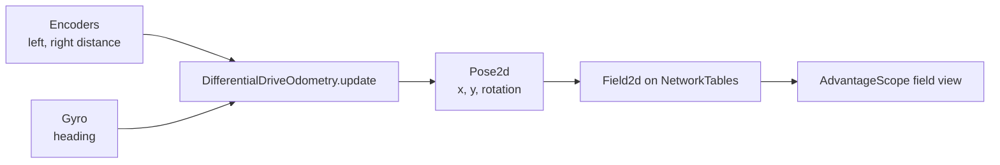

# Sensors and Feedback

So far the robot only sends: stick in, motor out. Sensors let it listen. This page covers the two sensors on the Romi, what you can compute from them, and the idea of feedback that runs every mechanism on a competition robot.

## 📏 Encoders

An **encoder** counts how far a shaft has turned. The Romi has one on each wheel: 1440 counts per full turn. The wheel is 70 mm across, so one turn is about 8.66 inches of travel.

```text
inches = counts * (pi * wheelDiameterInch / countsPerRevolution)
```

The drivetrain already does this conversion once, in its constructor, with `setDistancePerPulse`. After that, `getLeftDistanceInch()` returns inches directly.

Encoders count in both directions. Drive backward and the count goes down.

## 🧭 The gyro

A **gyro** measures rotation rate, and WPILib adds up the rate over time to give an angle. The Romi's control board has one. `RomiGyro.getAngleZ()` returns the heading in degrees since the last reset. Turn the robot left and right and the number follows.

It drifts a little over minutes, which is why every routine resets it at the start.

## 🗺️ Odometry: where am I?

Put wheel distance and heading together and you can dead-reckon the robot's position from where it started. WPILib's `DifferentialDriveOdometry` does the math. You feed it heading and the two wheel distances every loop, and it hands back a **pose**: x, y, and heading.



WPILib does all of this in **meters** and **counterclockwise-positive** rotation. Your job is to convert at the edges.

## 🎯 Setpoints and feedback

A **setpoint** is where you want to be: 12 inches ahead, 90 degrees left, 1000 RPM. A sensor tells you where you are. The difference is the **error**. **Feedback control** means adjusting the output based on the error, over and over, until the error is zero.

Session 6's `DriveDistance` is the simplest version: drive until the encoder says you have gone far enough, then stop. Real mechanisms use **PID**, which scales the push to the size of the error so the robot slows down as it arrives. A SPARK MAX can run that loop on board. Either way, the sensor is the half of the loop you cannot skip.

## 📡 Telemetry

Sensor values are numbers that change 50 times a second. You want to **see** them, not read them in a text log. Publishing to NetworkTables costs one line per value:

```java
SmartDashboard.putNumber("Drive/headingDeg", getGyroAngleDegrees());
```

AdvantageScope reads NetworkTables live and plots anything you publish. Session 5's exercise publishes three numbers and a pose, then plots them.
